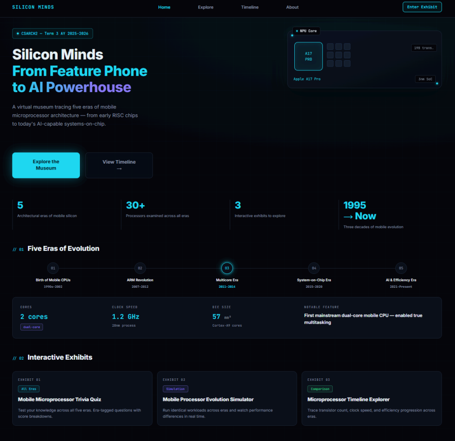
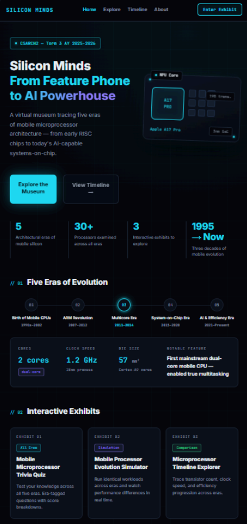

# Silicon Minds: The Evolution of the Mobile Microprocessor
### Virtual Exhibit Proposal — CSARCH2, Term 3 A.Y. 2025-2026
**De La Salle University - Manila**

---

## 1. Group Information

### 1.1 Proposed Title
Silicon Minds: The Evolution of the Mobile Microprocessor

### 1.2 Member Roster

| # | Full Name | GitHub Handle |
|---|-----------|----------------|
| 1 | Maria Fides Bancoro | [@m-fides](https://github.com/m-fides) |
| 2 | Marc Jared Sean Ercia | [@MarcErcia](https://github.com/MarcErcia) |
| 3 | Theodore Rodolfo III Garcia | [@theoithinkk](https://github.com/theoithinkk) |
| 4 | Theon Schuyler Garcia | [@SchuylerGYo](https://github.com/SchuylerGYo) |
| 5 | Nathaniel Singh | [@Redaw-t](https://github.com/Redaw-t) |

### 1.3 Detailed Project Description

**Silicon Minds: The Evolution of the Mobile Microprocessor** is an immersive, interactive virtual museum tracing the architectural journey of the mobile microprocessor. From their origins as simple processors designed for mobile communication devices to their current role as the engines powering smartphones, tablets, and other everyday mobile devices, the museum explores how mobile processors have evolved and improved over the years to meet modern computing demands.

Visitors are guided through five landmark eras in mobile microprocessor development: **The Birth of Mobile CPUs**, **the ARM Revolution**, **the Multicore Era**, **the System-on-Chip Era**, and **the AI & Efficiency Era**. Each era is framed around a compelling narrative arc of the limitations that drove innovation, the architectural breakthroughs that followed, and the ripple effects these advancements had on mobile device performance, power efficiency, and user experience. Rather than presenting history as a sequence of technical specifications, the exhibit tells the story of how the constantly increasing demands for speed, battery life, and multitasking influenced the design of mobile microprocessors.

To make these concepts tangible, the exhibit integrates three core interactive experiences. The **Microprocessor Timeline Explorer** serves as the center of the exhibit, allowing users to explore major mobile microprocessor generations and examine their specifications. The **Mobile Processor Evolution Simulator** will help users visually analyze how processors from different generations handle the same workloads, revealing the improvements in performance. Lastly, the **Mobile Microprocessor Trivia Quiz** will test the visitors on their understanding of the presented key concepts in an engaging, low-stakes format.

At the end of the exhibit, visitors would have developed a clear, intuitive understanding of not only how mobile microprocessors evolved, but also why the innovations that emerged through the years led to the powerful processors modern mobile devices have. They will gain insight into how advancements improved and transformed devices from simple communication tools to powerful and heavily functional computing platforms used in everyday life today.

---

## 2. Topic Theme

### 2.1 Overview

The mobile microprocessor stands as one of the most consequential innovations in computing history. Beginning as a modest, low-power adaptation of desktop RISC designs, it has grown into a highly integrated, AI-capable system-on-chip that fits in the palm of a hand, yet rivals laptop-class performance. This exhibit traces that evolution across five distinct eras, each defined by a breakthrough in architecture, manufacturing, or capability that permanently changed what mobile devices could do. The narrative is organized around the engineering tensions that drove each transition — from battery-life constraints that forced creative core design to consumer demand for richer applications that pushed transistor counts into the billions.

### 2.2 Five Eras of Mobile Microprocessor Evolution

| Era | Period | Key Milestone |
|-----|--------|----------------|
| **Birth of Mobile CPUs** | Mid-1990s–Early 2000s | Early low-power RISC processors adapted for mobile phones. E.g., ARM7TDMI, Intel StrongARM, Motorola DragonBall. |
| **The ARM Revolution** | 2007–2012 | ARM architecture dominates smartphones; dedicated ISPs and DSPs emerge. E.g., ARM Cortex-A8, Apple A4, Qualcomm Snapdragon S1. |
| **The Multicore Era** | 2011–2014 | Dual- and quad-core mobile CPUs arrive, boosting multitasking and app performance. E.g., NVIDIA Tegra 2, Apple A6, Qualcomm Snapdragon 600. |
| **The System-on-Chip Era** | 2015–2020 | Highly integrated SoCs combine CPU, GPU, modem, and memory on a single die. big.LITTLE heterogeneous cores improve power efficiency. E.g., Apple A9, Qualcomm Snapdragon 820, Samsung Exynos 8890. |
| **The AI & Efficiency Era** | 2021–Present | Dedicated NPUs enable on-device AI; TSMC 3nm/4nm nodes push performance-per-watt to new heights. E.g., Apple A17 Pro, Qualcomm Snapdragon 8 Gen 3, MediaTek Dimensity 9300. |

---

## 3. Tech Stack Plan

### 3.1 Core Technologies

The following table summarizes the full technology stack, aligned to the project requirements (Node.js 26, Astro 6) and optimized for seamless integration into the central museum website.

| Layer | Technology | Notes |
|-------|-----------|-------|
| Runtime | Node.js 26 | Required per project specs; LTS stability. |
| Framework | Astro 6 | Static-site generation with island architecture; forked from provided template. |
| Content | .mdx files | MDX (Markdown + JSX) for rich, component-embedded content pages. |
| Interactive UI | React 18 (.jsx) | All interactive components built as React islands embedded in .mdx. |
| Styling | Tailwind CSS v4 | Utility-first CSS; follows the central museum template style guide. |
| Version Control | Git / GitHub | Repository forked from template; all docs, plans, and feedback tracked via commits. |
| Responsive | CSS Grid / Flexbox | Mobile-first breakpoints; timeline scrolls horizontally on desktop, vertically on mobile. |
| Animation | Framer Motion | Handles smooth animations, transitions, and interactive feedback. |
| Icons | Lucide React | Consistent icon system for UI controls, era tags, and tooltip pins. |
| Hosting | GitHub Pages | Static output deployed via `astro build`; automated via GitHub Actions on push to main. |

### 3.2 Mobile Responsiveness

All components are built mobile-first:

- **Mobile Microprocessor Trivia Quiz:** Question cards stack vertically and fill the screen width on mobile (<640px). Answer buttons expand to full width for easy tap targets (min-height: 48px). Score card collapses to a single centered summary panel.
- **Microprocessor Timeline Explorer:** Horizontal scroll on desktop (≥768px); switches to a vertical stacked card layout on mobile. Expanded spec cards go full-width. Era filter buttons collapse into a horizontally scrollable pill row.
- **Mobile Processor Evolution Simulator:** On mobile (<640px), selected era panels are stacked vertically so each simulation is visible on the screen. The Era Highlights (information) and Performance Metrics sections are collapsible and can be expanded when the user chooses to do so. On desktop, simulation panels are displayed side by side, while Era Highlights and Performance Metrics panels remain visible below the simulation for easy comparison.

---

## 4. Interactive Components

| # | Component | Type | Summary |
|---|-----------|------|---------|
| 1 | **Mobile Microprocessor Trivia Quiz** | Quiz | Knowledge check supporting what users have learned after browsing through the five eras of mobile microprocessor evolution. Each question is tagged to a specific era. Incorrect responses reveal a short explanation clarifying the right answer. |
| 2 | **Microprocessor Timeline Explorer** | Interactive Timeline | The central feature of the museum; allows users to trace the evolution of mobile microprocessors across different eras, present key generations, examine specifications, and differentiate developments across eras. |
| 3 | **Mobile Processor Evolution Simulator** | Simulation | Helps users visualize the evolution of mobile microprocessors by running the same task workload across processors from different eras. Users compare performances through real-time workload animations demonstrating how each generation's architectural innovations improved speed, efficiency, and task management over time. |

### 4.1 Mobile Microprocessor Evolution Trivia Quiz

**Purpose:** To test the user's understanding after browsing the exhibit.

**Interaction Details:**
- **Era-tagged questions:** Each question is labeled with its microprocessor era so users know what concept is being tested.
- **Multiple choice format:** 4 choices per question; wrong answers show a short explanation why.
- **Score Card:** Shows how many per era the users got right, motivating them to revisit weak spots in the exhibit.
- **Randomized Question Pool:** The bank contains 30 questions (6 per era). Each session presents 15 randomly selected questions (3 per era minimum guaranteed), shuffled on every load. Answer options within each question are also randomized.

### 4.2 Microprocessor Timeline Explorer

**Purpose:** To allow users to visually trace the progression of mobile microprocessor architectures across all five eras, giving them a concrete sense of how dramatically performance, efficiency, and capability have evolved over the decades.

**Interaction Details:**
- **Era Nodes:** Each landmark mobile microprocessor generation is represented as a clickable node along the timeline. Clicking a node expands a spec card displaying transistor count, core configuration, speed, efficiency improvements, and other notable architectural features.
- **Era Filter Buttons:** Users can filter the timeline to focus on a single era, dimming all other nodes to reduce visual clutter and highlight one generation at a time.
- **Spec Card Animations:** Expanded cards appear with entrance animations (500ms, cubic-bezier ease-out) consistent with the style guide, and collapse smoothly when another node is selected or the card is dismissed.
- **Comparative View:** Users can select two nodes simultaneously to display their spec cards side by side, making cross-era comparisons immediately readable.
- **Responsive Layout:** On desktop (≥768px), the timeline scrolls horizontally with nodes laid out left to right. On mobile (<640px), the layout switches to a vertical stacked card view for easier single-thumb navigation.

### 4.3 Mobile Microprocessor Evolution Simulator

**Purpose:** To help users better visualize and compare the performance of mobile microprocessors across eras through a simple simulation of how different processors handle identical workloads. After selecting processor eras, users can observe how processing speed, power efficiency, and task management capabilities differed across generations.

**Interaction Details:**
- **Era Selection:** Before simulation starts, users are given the option to select two or more mobile microprocessor eras to compare performance. These selected eras serve as the basis for the side-by-side comparison.
- **Identical Workload Simulation:** All selected eras are given a standardized workload, and each will simulate how their microprocessors would handle the task using visuals. Simple animations show differences in completion time, smoothness, and efficiency of each microprocessor based on predefined processor behavior.
- **Comparative View:** The simulation is displayed in a side-by-side layout so users can see and compare performances handling the same workload in real-time.
- **Microprocessor Highlights:** A panel beside the simulation displays important information of the microprocessor introduced in the chosen eras — name, core count, speed, and significant architectural innovations.
- **Performance Metrics and Feedback Panel:** After the simulation, performance metrics are displayed showing how each era handled the task differently in terms of processing speed, power efficiency, etc. This panel summarizes results so users can better compare the microprocessors.
- **Replay Simulation Option:** After the simulation, users can restart it or select different processor eras to compare.

---

## 5. Style Guide Snapshot

### 5.1 Design Philosophy

The exhibit uses a high-contrast dark palette to evoke the aesthetic of system diagnostics, chip datasheets, and performance monitoring interfaces — the visual language engineers use when working with hardware itself. The design is inspired by VSCode and futuristic games like Cyberpunk 2077. Monospace typography for technical data, layered surface cards, and a structured grid system reference the precision and density of silicon design. This creates a focused, professional museum atmosphere that lets each generational leap in mobile processor capability speak for itself, without unnecessary decoration.

All color and spacing decisions below are finalized and serve as the source of truth for all component implementations.

### 5.2 Style Tokens

| Element | Value | Usage |
|---------|-------|-------|
| Primary Color | `#00E5FF` / cyan-400 | Era highlights, active states, key callouts |
| Secondary Color | `#7B61FF` / violet-500 | AI & Efficiency era accent, interactive hover, quiz feedback |
| Background | `#0A0A0F` | Page-level background, deep space feel |
| Surface Cards | `#141420` | Era cards, quiz panels, viewer container |
| Primary Text | `#F0F0F5` | Body copy, headings, labels on dark surfaces |
| Secondary Text | `#8888A0` | Metadata, dates, captions, disabled states |
| Typography (Headings) | Space Grotesk 500/700 | Era titles, section headers, component names; geometric sans to echo silicon aesthetics |
| Typography (Body) | Inter 400/500, 16px / 1.7 | Exhibit copy, descriptions, quiz questions |
| Typography (Technical Data) | JetBrains Mono 400, 13px | Spec numbers, benchmark values, table data, transistor counts, clock speed figures |
| Border Radius | sm: 4px / md: 8px / lg: 16px | sm for tags/chips; md for cards, inputs; lg for major panels, simulator container |
| Grid System | 12-col, 24px gutter, 40px margin | Timeline: full-width scroll; components: 6-col or 12-col spans on desktop |
| Spacing Scale | 4 · 8 · 16 · 24 · 40 · 64 px | 4px intra-element, 16–24px intra-card, 40–64px between major sections |
| Shadows | `0 0 0 1px rgba(0,229,255,0.12)` | Subtle cyan glow-border on cards; no traditional drop shadows on dark bg |
| Animation Duration | fast: 150ms / standard: 300ms / entrance: 500ms | fast → hover feedback; standard → transitions; entrance → era card reveal, quiz score |
| Animation Easing | `cubic-bezier(0.16, 1, 0.3, 1)` | Snappy ease-out for all transitions; conveys precision and responsiveness |
| Component Borders | 1px solid rgba(255,255,255,0.08) | Default card borders; inactive timeline nodes |
| Interactive Feedback | Cyan glow + scale(1.02) | Hover on era cards, quiz options, simulator panels; correct answer → green glow; wrong → red flash |
| Timeline Accent | Gray → Cyan gradient | Horizontal timeline track; past eras desaturate, current/active era glows cyan |
| Responsive Breakpoints | mobile: <640px / tablet: 640–1024px / desktop: ≥1024px | Matches Tailwind sm/md/lg; timeline switches axis at 768px per spec |

### 5.3 Accessibility

The exhibit targets WCAG 2.1 AA compliance throughout. The following requirements are binding for all component implementations:

- **Contrast Ratios:** Primary text (`#F0F0F5`) on background (`#0A0A0F`) yields 16.9:1, well above the 4.5:1 AA minimum. Secondary text (`#8888A0`) on background achieves 5.1:1.
- **Focus States:** All interactive elements have a visible 2px solid `#00E5FF` focus ring with 2px offset, replacing the browser default.
- **ARIA Labels:** All icon-only buttons carry descriptive `aria-label` attributes. The simulator component exposes `role="region"` with a text alternative summarizing the currently selected processor era and workload result.
- **Reduced Motion:** All animations respect `prefers-reduced-motion: reduce` — entrance animations and transitions are disabled, replaced with instant state changes.
- **Keyboard Navigation:** The timeline, quiz, and era navigator are fully operable via keyboard. The simulator supports Tab-key navigation between era panels and Enter to trigger or restart the simulation.

### 5.4 Style Guide Mockup

| Desktop Layout | Mobile Layout |
|----------------|----------------|
|  |  |

*Figure 1. Desktop Layout Mockup of Virtual Exhibit Landing Page*
*Figure 2. Mobile Layout Mockup of Virtual Exhibit Landing Page*

---

## 6. Revisions from Original Proposal

> Full revision comments/attachment: [`/docs/revisions.pdf`](./docs/revisions.pdf)

**Summary of key changes from the original GPU Evolution proposal:**

- **Topic change:** Pivoted from *GPU Evolution: From Fixed-Function Pipelines to Massively Parallel AI Accelerators* to *Silicon Minds: The Evolution of the Mobile Microprocessor*, shifting the five eras from GPU architecture (Fixed-Function Hardware → AI Accelerator Era) to mobile CPU/SoC architecture (Birth of Mobile CPUs → AI & Efficiency Era).
- **Interactive components reworked:** Replaced the **3D GPU Viewer** (Three.js / React Three Fiber, GLTF/GLB models) with the **Mobile Processor Evolution Simulator**, removing the 3D rendering dependency entirely.
- **Tech stack:** Removed Three.js / React Three Fiber from the stack (no longer needed without the 3D Viewer); added Framer Motion for animation, which was implicit but unlisted in the original.
- **Timeline Explorer renamed and re-scoped:** *GPU Spec Timeline Explorer* → *Microprocessor Timeline Explorer*; spec card fields updated from GPU-specific metrics (VRAM, memory bus, TDP) to mobile CPU/SoC metrics (transistor count, core configuration, clock speed, die size).
- **Trivia Quiz re-scoped:** *GPU Architecture Trivia Quiz* → *Mobile Microprocessor Trivia Quiz*; same structure (30-question bank, 15 per session, 3 per era minimum) retained, content updated to mobile microprocessor eras.
- **Accessibility spec updated:** Removed the 3D viewer–specific ARIA `role="application"` and arrow-key orbit/zoom controls (no longer applicable); simulator now exposes `role="region"` with a text alternative summarizing the selected era and workload result.
- **Style guide retained:** Color palette, typography, spacing scale, border radii, animation durations/easing, and WCAG 2.1 AA accessibility targets carried over unchanged from the original proposal.
- **Branding/copy updated:** Landing page headline changed from "GPU Evolution / From Pixels to Intelligence" to "Silicon Minds / From Feature Phone to AI Powerhouse"; nav label "GPU MUSEUM" → "SILICON MINDS".

---

## 7. Repository Structure

```
/
├── README.md                  # This file — full proposal write-up (incremental)
├── docs/
│   ├── revisions.pdf          # Final proposal with all revisions
│   └── assets/                # Mockup images (Figures 1 & 2)
├── src/
│   ├── pages/                 # Astro pages (.astro/.mdx)
│   ├── components/            # React islands (Timeline, Simulator, Quiz)
│   ├── content/                # Era data, quiz question bank
│   └── styles/                # Tailwind config & global styles
├── public/
│   └── assets/                # Icons, processor images
└── .github/workflows/         # GitHub Actions deploy config
```
---

## 8. Getting Started

```bash
npm install
npm run dev
```

Build for production:

```bash
npm run build
```
